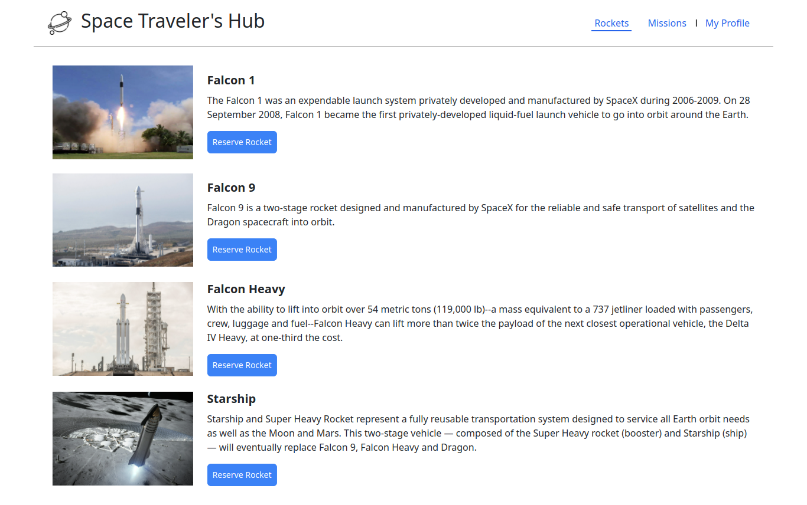
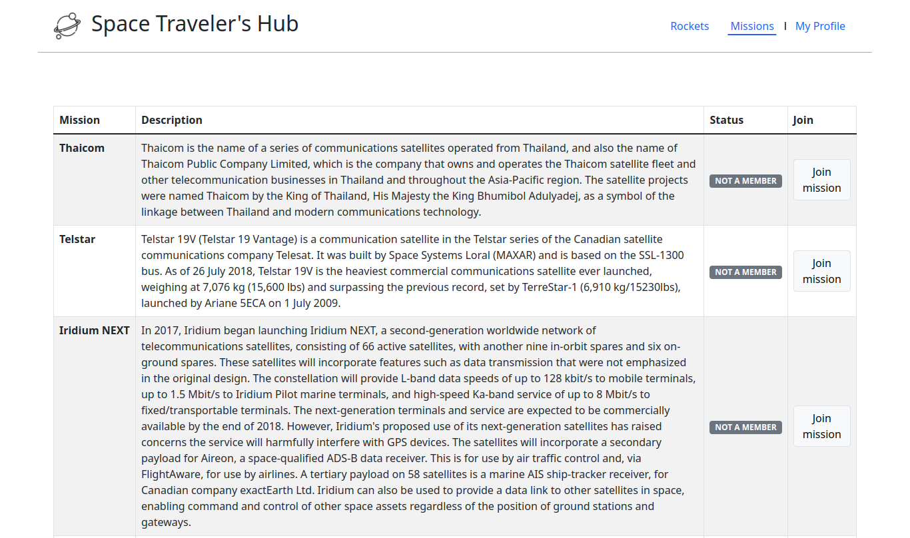

# Space Travelers Hub


> A single page app where users can book space rockets and missions! 

## Screenshots

- **Rockets page**



- **Missions page**



## Built With

- HTML5, CSS3
- JavaScript ES6, React/Redux, Tailwind, Bootstrap
- CLI, TDD, gh-pages, Gitflow

## Live demo

You can visit live version via [link](https://amiraabouhadid.github.io/space_travelers_hub/)

## Getting Started

To get a local copy up and running follow these simple example steps:
- Open Terminal.
- Change the current working directory to the location you want the cloned directory.
- Enter the following:
```
$ git clone git@github.com:amiraabouhadid/space_travelers_hub.git.
```
- Press Enter to create your local clone.
- Navigate to the cloned repository by running:
    ```
    $ cd space_travelers_hub
    ```
- Install all dependencies using:
    ``` 
    $ npm install
    ```

- Run local server using:
    ```
    $ npm run build
    $ npm start
    ```
- Run unit tests using:
    ```
    $ npm run test

    ```

### Prerequisites
- GitHub
- Git
- Node.js


## Authors

👤 **Amira Abouhadid**

- GitHub: [@amiraabouhadid](https://github.com/amiraabouhadid)
- Twitter: [@AbouhadidAmira](https://twitter.com/AbouhadidAmira)
- LinkedIn: [amira-abouhadid](https://www.linkedin.com/in/amira-abouhadid/)

👤 **Jonathan Sivahera**

- GitHub: [@jssol](https://github.com/jssol)
- Twitter: [@jsivahera](https://twitter.com/jsivahera)
- LinkedIn: [jsivahera](https://www.linkedin.com/in/jsivahera/)

## Contributors

Contributions, issues, and feature requests are welcome!

Feel free to check the [issues page](https://github.com/amiraabouhadid/space_travelers_hub/issues).

## Show your support

Give a ⭐️ if you like my portfolio!

## 📝 License

- This project is [AGPL-3.0](./LICENSE) licensed.
